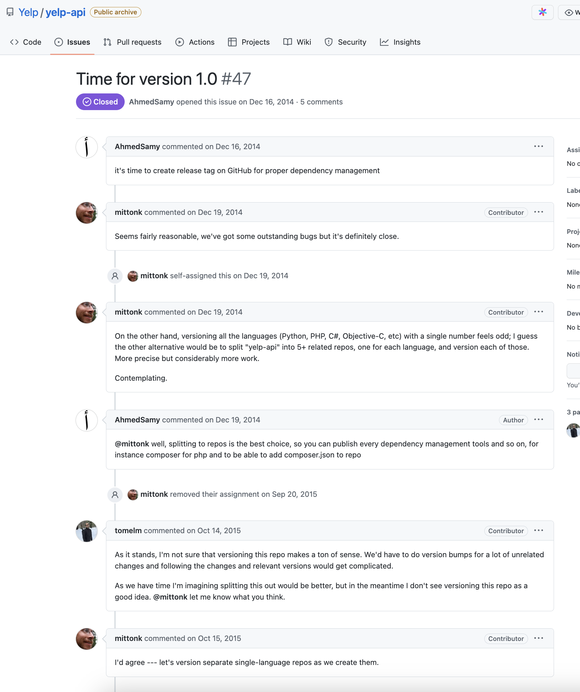

# Versioning

How would you advise the team to version their software? How would those versions be reflected in their API, code, builds, CI/CD system, etc.?

## Summary
I recommend we default to [Semantic versioning](#Semantic-Versioning) when possible for API, Application code, build, and CI/CD systems. 

We should rely on regression testing and trust the engineering team to make the final decision if a major version change is necessary. When a major version change is identified we should give ALL stakeholders adequate timelines to make any necessary changes. 

We can use incremental version number in the database and leverage our database migration tool such as [Goose](https://github.com/pressly/goose) to faciliate this. 


## Semantic Versioning API, Code, Infra


```
                   MAJOR.MINOR.PATCH
                  /       |       \
   Breaking Changes  |  New Features  |  Bug Fixes
                 /        |         \
1.0.0-alpha.1   1         0          0        alpha release
```

I would recommend we use [Semantic Versioning](https://semver.org/) for application code. 

The version number consists of three parts, separated by periods: MAJOR, MINOR, and PATCH. Each part represents a different type of change:

**MAJOR:** Signifies a major change that is not compatible with older versions. For example, removing or changing existing functionality would be a major change.

**MINOR:** Signifies a minor change that is backward-compatible with older versions. For example, adding a new feature or enhancement would be a minor change.

**PATCH:** Signifies a bug fix or other change that does not affect compatibility. For example, fixing a security issue or improving performance would be a patch.


For instance, if the current version of the software is 1.0.0 and a major change is made that breaks backward compatibility, the new version would be 2.0.0. If a minor change is made that adds a new feature but does not break compatibility, the new version would be 1.1.0. If a patch is made to fix a bug, the new version would be 1.0.1.

## Database Versioning 


I recommend we use database versioning that exists within the database schema migration of choice. Database migrations are a series of scripts that describe changes to the database schema, such as adding or modifying tables, columns, or indexes.

Each migration script is associated with a version number or timestamp, and the migration scripts are executed in order to bring the database schema up to the desired version.

When a schema change is made, a new migration script is created, and the version number or timestamp is incremented. This helps to keep track of which changes have been made to the schema and when, making it easier to understand and revert changes if needed.


```
20220101120000_add_first_table.sql
20220101120001_add_second_table.sql
```


There are known edge cases when many developers are working on the same branch, which can be fixed by applying a sequential ordering at deploy time through a command "goose fix" as described in the following github issue: https://github.com/pressly/goose/issues/63#issuecomment-428681694


## Real World Battle Stories

If we already have code that has not been versioned or we are still in highly experimental mode. I would recommend to look at Python and Rust versioning history as case studies to think about how to version our application code. 

### Python Version Story


Python uses the MAJOR.MINOR.PATCH format for version numbers, where a MAJOR version change indicates a backward-incompatible change, a MINOR version change indicates new functionality that is backward-compatible, and a PATCH version change indicates bug fixes and other changes that do not affect compatibility.

If we already have code that has not been versioned or we haven't aligned to something specific I would recommend to look at Python and Rust versioning history to help drive the decision. 


**Python - Lessons in Python history, Python 2 vs Python 3**

This was a very painfull lessons for the python community. 

Here is a talk with Guido van Rossum and Lex Fridman that explain the painpoints of releasing a backwards incompatible version the dreaded migration from Python 2 to Python 3 and how python 4.0 might look. 


https://www.youtube.com/watch?v=qC5Po77bfKI

**Summary:**

Python 3 was a significant update over Python 2, requiring significant effort from the community and core development team to transition. However, the transition was ultimately successful, and Python 3 has been the standard for several years.

The community and core development team have painful memories of the Python 3 transition, making them cautious about any future changes. 
As a result, there are no plans for a Python 4.0 anytime soon. If there is to be a Python 4.0, the transition process will be different, and there will be a different reason for its creation.If Python 4.0 were to be released, it would break backward compatibility, making the transition challenging for users. 

To make the transition as smooth as possible, a Python 4.0 release would not introduce new syntactical features or modules in the standard library. Everything would be purely compatible with Python 3.19 at the Python level. However, extension modules would have to be recompiled and would have a different binary interface and APIs, making them incompatible with previous versions. 

To prepare for a Python 4.0 release, the community would need to give extension developers a significant heads up to keep developing their extensions.

The release of Python 4.0 would be a significant event for the Python community, requiring significant effort and preparation. Extension developers would need to be given a significant amount of notice to ensure a smooth transition, and the release of Python 4.0 would signal a new era for Python.

### Rust Version Story


Watch: https://youtu.be/79PSagCD_AY?t=2469

**Summary:**

Rust was developed over a period of 8 years with a focus on choosing the best options, regardless of backwards compatibility. Once the language matured, a decision was made to make everything backwards compatible from a specific date.

May 2015 was the first stable release (Rust 1.0) was the stable release that stopped the changes and stabilized the language's syntax and features. The release was a significant milestone for Rust as it marked the end of its development as an experimental language and the beginning of its use as an industry-ready language.


> May 15, 2015 - 1.0.0 "At this point Rust decided to release only backwards compatible changes! So no longer will you have to rewrite your library 5 times a week."

### Yelp 1.0 API Story

https://github.com/Yelp/yelp-api/issues/47



Make sure you document your API code!

Example: https://docs.developer.yelp.com/reference/v3_business_search


## Summary

Let's use semantic versioning which is backwards compatible when it makes sense to do so! Let's have open discussions through code reviews and pair programming sessions. 

If the code is tightly coupled one could argue that semantic versioning that is the same across all parts of the stack, API Code, Database schema Code, Application Code, and using the same version number across components is the correct way but that premise only exists if the codebase is small and we are willing to tradeoff developer velocity in order to prevent code breakage. 


# How I can halp! 

I would faciliate a SWOT session and include various stakeholders.

- https://www.alignment.io/10614/SWOT-Analysis-Board

> SWOT analysis is a strategic planning tool used to identify an organization's Strengths, Weaknesses, Opportunities, and Threats. It helps to assess the organization's current position in the market and identify areas for improvement. The analysis involves identifying internal factors, such as strengths and weaknesses, and external factors, such as opportunities and threats. Once the analysis is complete, the organization can use the results to develop a strategy to take advantage of its strengths, minimize its weaknesses, take advantage of opportunities, and mitigate threats.


