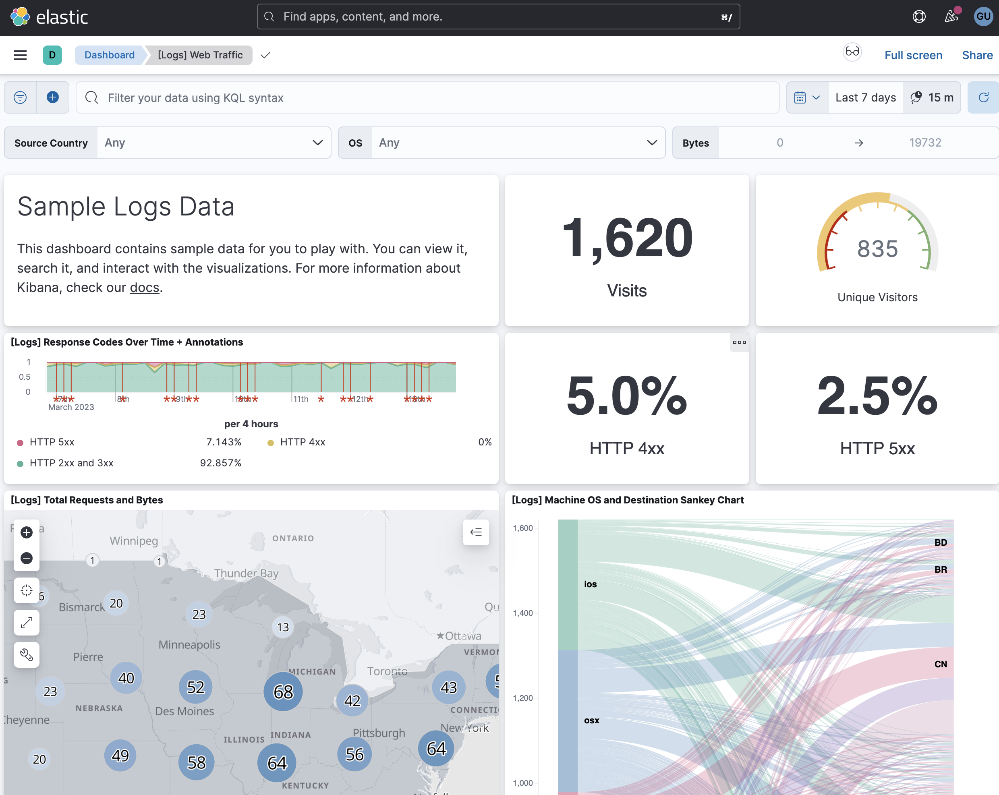

# Observability 

"How would you recommend they monitor their system in order to maintain their SLA?

I would use Logs, Metrics, UserEvents and Distributed tracing to help craft a observability story. 

## Logs

I would recommend that the team leverages application logs to monitor during and after deployment but also as a way to identify and mantain their SLA. 

For log monitoring, I would suggest considering two options: AWS CloudWatch and the ELK stack. AWS CloudWatch is a cloud-based monitoring service that provides log management and real-time metrics. It offers features like customizable dashboards, alerts, and automated responses to events but unfortunately I think the developer experience is not that great and it can be a bit of hassle collecting logs from within docker containers.

The ELK stack (Elasticsearch, Logstash, and Kibana) is a popular open-source solution that allows for centralized log management and analysis. Using the ELK stack can provide a better developer experience as it offers more flexibility and customization options than CloudWatch. It allows developers to create customized dashboards, perform advanced log queries, and analyze log data in real-time. (If we have the cycles, this is what I recommend.)

We could leverage something like "Elastic Cloud on Kubernetes" to deploy it: https://github.com/elastic/cloud-on-k8s 

[Check out a live demo](https://demo.elastic.co/app/dashboards#/view/edf84fe0-e1a0-11e7-b6d5-4dc382ef7f5b?_g=(filters:!()))

We can use the above dashboard to make a decision if a rollback is necessary. 

Furthermore we can use these logs to visualize our historical SLA:

[Check out uptime live demo](https://demo.elastic.co/app/uptime)

## Metrics

Metrics provide a way to alert on real-time issues such as out of memory or if we are getting too many errors. These metrics typically have a sub-5-second frequency. I would recommend using Prometheus and Grafana for monitoring and attach something like pagerduty. 

The pagerduty alerts and oncall rotation is something that can be discussed once the need arises in order to mitigate any incidents that may cause SLA violations.

Common metric candidates for Pagerduty alerts:

1.  Response Time: The time it takes for a system to respond to a request. High response times can indicate performance issues and affect SLA.
    
2.  Error Rate: The percentage of requests that result in an error. High error rates can indicate system issues that need to be addressed.
    
3.  Throughput: The number of requests processed by the system over a certain period of time. Monitoring throughput can help identify system capacity and performance issues.
    
4.  CPU Utilization: The percentage of CPU usage on the system. High CPU utilization can indicate resource constraints that may affect system performance.
    
5.  Memory Utilization: The percentage of memory usage on the system. High memory utilization can indicate memory leaks or other issues that may impact system performance.
    
6.  Network Latency: The time it takes for a network request to be sent and received. High network latency can indicate connectivity issues that may impact system performance.
    
7.  Disk Usage: The percentage of disk space used on the system. Monitoring disk usage can help prevent disk space issues that may affect system performance.

**Grafana Dashboard:**

## User Events

User events are useful for calculating daily active users and for A/B testing various features. To create user events, I recommend using a custom logging framework to send them to our /v1/events/ API. From there, the events can be added to an S3 file store, with any personally identifiable information scrubbed before landing. We can then run Spark jobs to send the events to a Kafka queue for further processing. Finally, we can land these events into fact and dimension tables via ETL jobs, and visualize them with Apache Superset."

Candidates for User events:

1.  User Sign-Ups: Events that capture user sign-ups or account creations. These events can be used to track user acquisition and identify popular sign-up channels.
    
2.  User Logins: Events that capture user logins to the system. These events can be used to track user engagement and identify popular features.
    
3.  User Actions: Events that capture user actions in the system, such as clicks, searches, and purchases. These events can be used to understand user behavior and preferences, and identify popular or problematic features.
    
4.  User Feedback: Events that capture user feedback or reviews. These events can be used to gather user sentiment and improve the user experience.
    
5.  User Errors: Events that capture user errors or failed actions. These events can be used to identify areas of the system that are causing problems for users and need improvement.
    
6.  User Sessions: Events that capture user sessions or the duration of time a user spends in the system. These events can be used to understand user behavior and preferences, and identify popular or problematic features.

**Apache-Superset Dashboard:**

## Distributed tracing 

We can use something like Zipkin or jaeger to  monitor our services to service communication and identify any bottle necks and hotspots. 

Here's how it works:

1.  You add some code to your application to capture trace data as requests move through the system.
    
2.  This trace data includes stuff like request ID, when the request was received and completed, and what services were involved in processing the request.
    
3.  You can then use tools like Jaeger or Zipkin to visualize this trace data as a sequence diagram. It shows you the order of services and how long each one took to process the request.
    
4.  By analyzing these traces, you can identify performance issues or errors that may be affecting your SLA. For example, you can see which services are running slow or causing bottlenecks.

**Zipkin Dashboard:**

# How I can halp! 

My recommendation is to start small by using AWS CloudWatch and the built-in features it provides. As your needs grow, you can gradually incorporate more advanced tools and techniques. This approach allows for a gradual transition to more complex monitoring solutions and can help ensure a smooth and successful implementation.

By being available during the implementation and maintenance phases, I can provide real-world advice on common pitfalls and best practices.

The main pain point is crafting effective queries and developing an alerting strategy that meets the team's needs. This requires a deep understanding of the team's dynamics and objectives. It's important to avoid false positives that may unnecessarily disrupt team members' sleep or cause them to lose trust in the monitoring system.

Oh, Did I mention that I have build end to end Observability pipelines at Microsoft? 